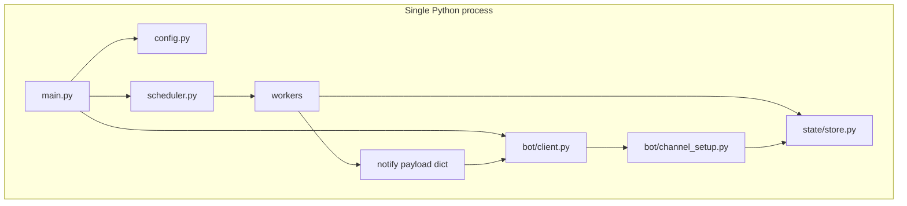

# Architecture — Discord monitor bot

## Overview

Single **Python** process on one **Render Background Worker**: a **Discord client**, **SQLite** (`worker_state` + `worker_channels`), **async scheduler**, and pluggable **workers** under `workers/`. Workers never import `discord`; they call an injected **`notify`** callback; the bot resolves **per-worker text channels** (auto-created in `MONITOR_GUILD_ID`) and builds embeds.

## Runtime

## Data (SQLite)

| Table | Purpose |
|-------|---------|
| `worker_state` | `worker_id` → JSON snapshot for change detection |
| `worker_channels` | `worker_id` → Discord `channel_id` for that worker’s feed |

Default path: `STATE_DB_PATH` (e.g. `data/state.db`). On Render, use a **persistent disk** path if you need stable DB across redeploys.

## Channel provisioning

- Channel names: `monitor-<sanitized_worker_id>` (see [`bot/channel_setup.py`](../bot/channel_setup.py)).
- **First** ensure: [`scheduler.run_scheduler`](../scheduler.py) calls `ensure_worker_channels` after `wait_until_ready()`.
- **Manual repair:** `/setupchannels` in the guild (Manage Server or `BOT_OWNER_USER_ID`).
- If posting to a worker channel fails, [`send_worker_notification`](../bot/client.py) falls back to `ALERT_CHANNEL_ID`.

## Worker contract

- [`workers/base.py`](../workers/base.py): `worker_id`, `interval_seconds`, `async def tick(self)`.
- [`workers/registry.py`](../workers/registry.py): `WORKER_IDS` + `build_workers(store, bot)`.
- [`scheduler.py`](../scheduler.py): one asyncio loop per worker; errors in one worker do not cancel others.

## Messaging style

Embeds use `MonitorBot.build_notification_embed` / `build_notification_embed_from_payload` (title, subtitle, link, fields, timestamp).

## Test mechanism

- `/testalert` — posts a sample embed to **`ALERT_CHANNEL_ID`** only (not worker channels).

## Shutdown

`main.py` uses `async with bot` so the Discord session closes cleanly.

## Related

- [`docs/ADDING_WORKERS.md`](ADDING_WORKERS.md) — how to add a worker
- [`docs/DEPLOYMENT_RENDER_GITHUB.md`](DEPLOYMENT_RENDER_GITHUB.md) — Render env vars
- [`AGENTS.md`](../AGENTS.md) — agent quick reference
