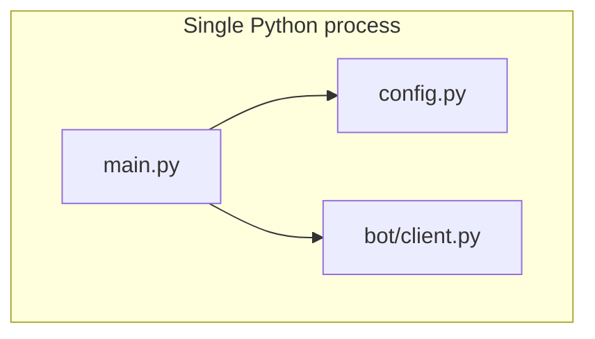

# Architecture — Discord monitor bot

## Overview

Current phase implements the **Discord relayer only** (no scraping workers yet). The bot is a single Python process suitable for one Render worker.

## Current runtime

## Messaging style

The relayer sends a dark-themed embed designed to match your reference style:

- Clear question-like title
- Short subtitle line
- Link field
- Metadata fields (`Mode`, `Event Index`, `Source`, `Event ID`)
- Timestamp + footer

## Test mechanism

- Slash command: `/testalert`
- Behavior: sends a sample alert embed to `ALERT_CHANNEL_ID`
- Optional lock-down: set `BOT_OWNER_USER_ID` so only you can run it

## Shutdown

`main.py` runs the client inside `async with bot` so the Discord session closes cleanly on exit (avoids leaked HTTP connections).

## Next architecture step (later)

When you are ready, add scheduler + workers while keeping worker modules Discord-agnostic:

- `workers/*` fetch and compare data
- Workers call injected `send_alert`
- Bot layer in `bot/` owns Discord APIs

## Related

- [DEPLOYMENT_RENDER_GITHUB.md](DEPLOYMENT_RENDER_GITHUB.md) — Render hosting
- [AGENTS.md](../AGENTS.md) — agent quick reference
